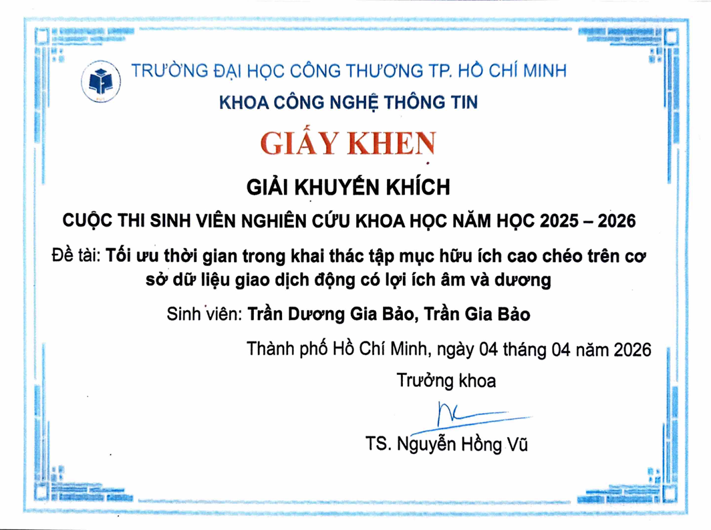
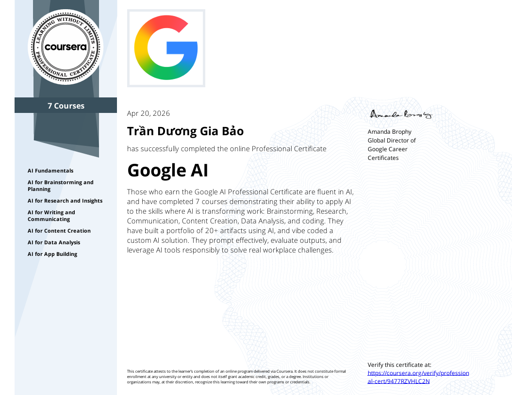
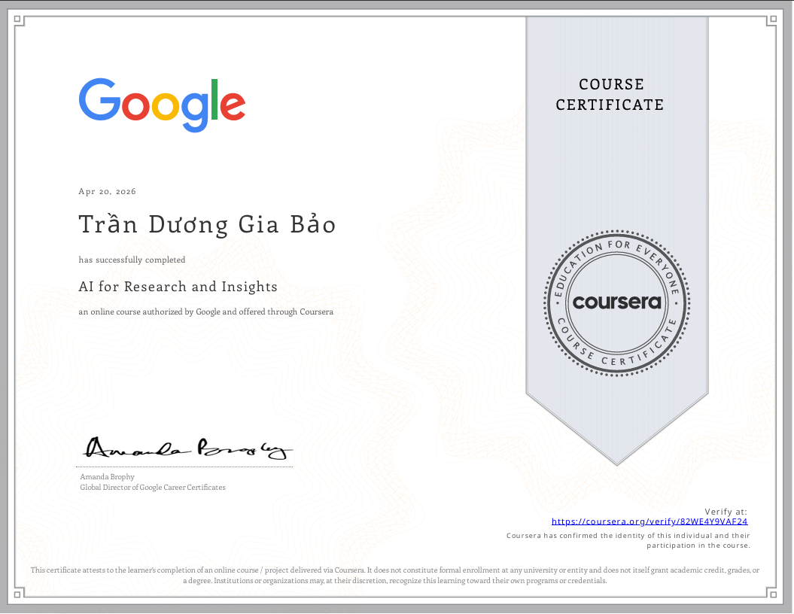
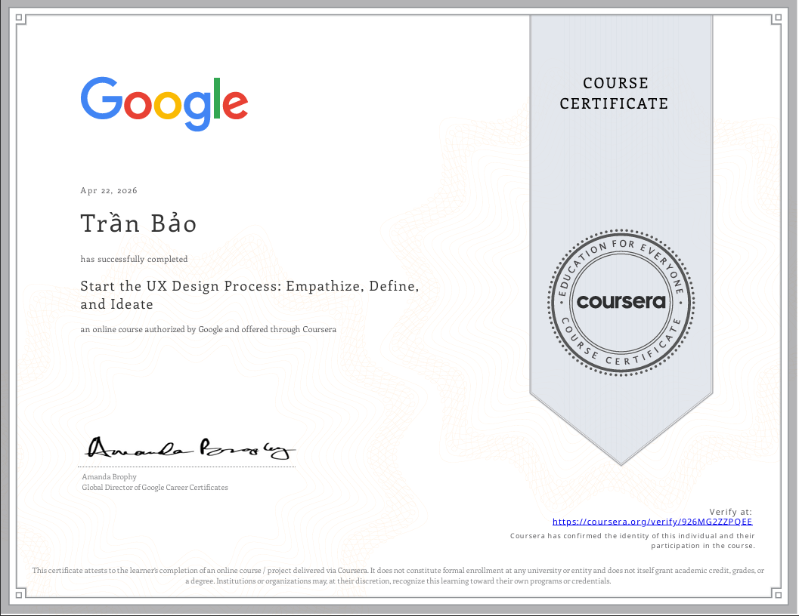
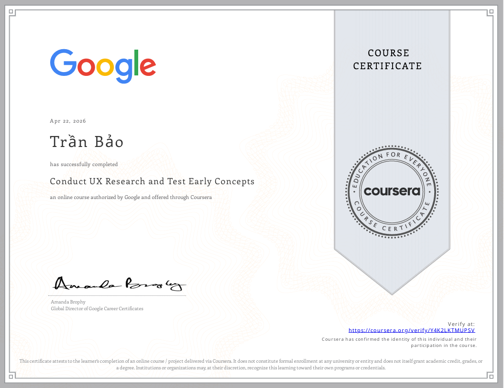
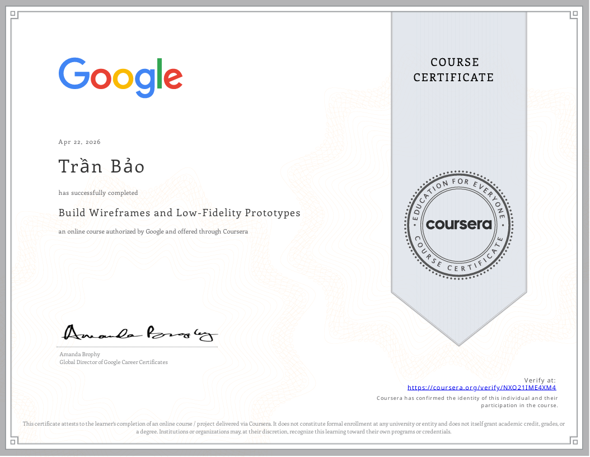
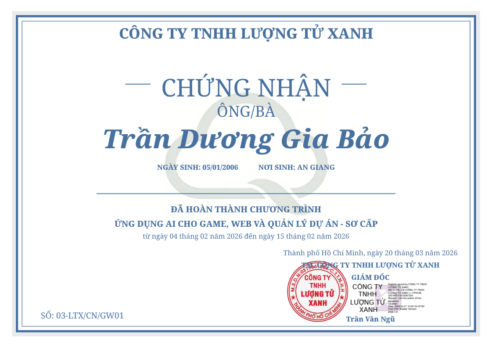
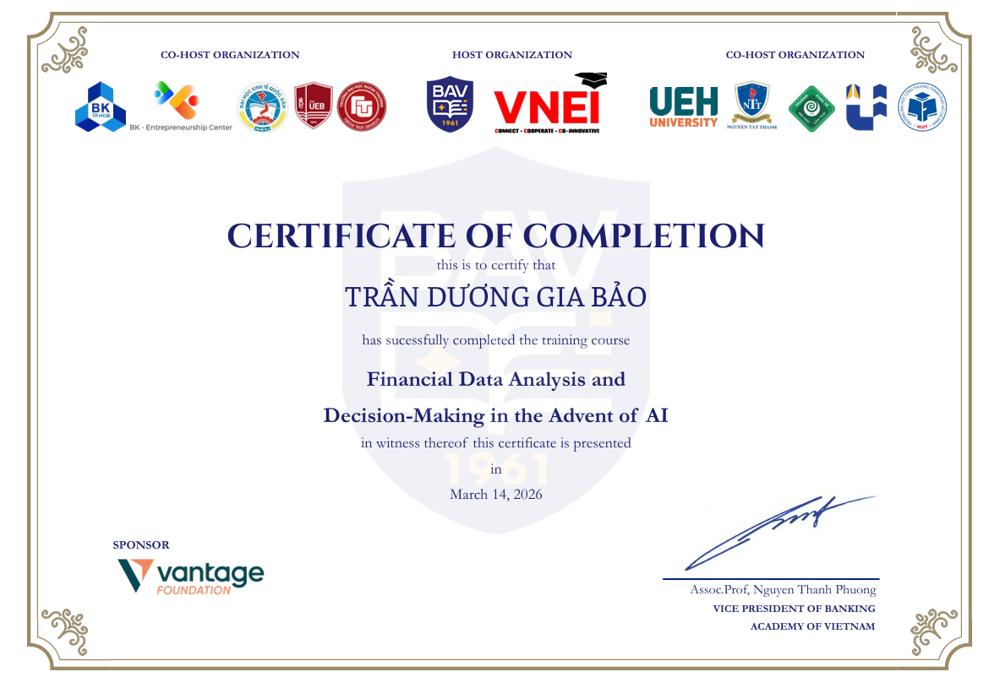
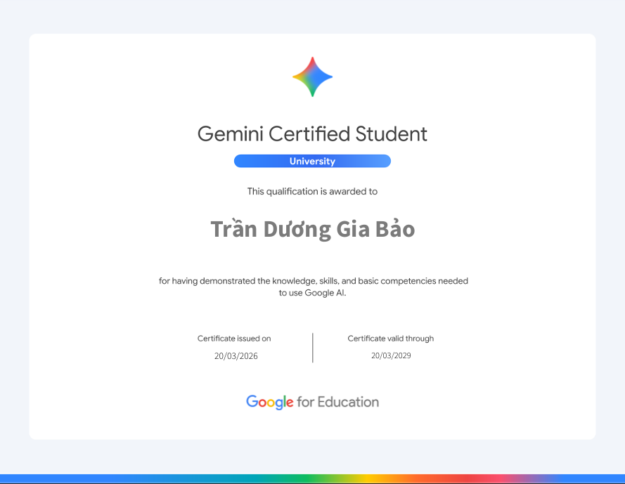

<div align="center">


<br/>

[](https://git.io/typing-svg)

<br/>


&nbsp;
[](https://github.com/Peo051?tab=followers)

</div>

<br/>

----------

### 👤 About Me

```yaml
# Trần Dương Gia Bảo — Software Engineering Student

location    : Ho Chi Minh City, Vietnam
university  : University of Industry and Trade (HUIT)
major       : Information Technology — Applied Computing
email       : tranduonggiabao0501email@gmail.com

focus:
  - Backend development with .NET / ASP.NET Core
  - Object-Oriented Design & Clean Architecture
  - Relational databases (SQL Server, T-SQL)
  - Applied AI & Data Science (exploring)

currently:
  - Building foundational engineering skills through academic projects
  - Participating in university-level technical competitions
  - Deepening understanding of system design & software architecture

goal: Become a reliable, impact-driven software engineer
      with strong fundamentals and a growth mindset.
```

---

### 🛠️ Technical Skills

#### Languages
<p>
  
  
  
  
  
</p>

#### Backend & Frameworks
<p>
  
  
  
  
</p>

#### Web
<p>
  
  
  
</p>

#### Databases & Tools
<p>
  
  
  
  
  
</p>

---

### 📌 Highlight Projects

#### ☕ [Coffee_Shop_Management_WPF](https://github.com/Peo051/Coffee_Shop_Management_WPF)
**Tech:** C# | WPF | .NET | SQL Server (Back-end WPF)

Desktop application for coffee shop management built with WPF (Windows Presentation Foundation) and C#.
This project demonstrates proficiency in building enterprise-level desktop applications with modern UI/UX design,
MVVM architecture pattern, database integration, and comprehensive business logic implementation for inventory,
sales, and customer management.

#### ☕ [Coffee_Shop_Management_WEB](https://github.com/Peo051/Coffee_Shop_Management)
**Tech:** HTML, CSS, JAVASCRIPT (Front-end Web)

Team project focused on building a coffee chain management website with a modern interface,
consistent brand identity, and user-centered experience. This project demonstrates the ability to
develop structured front-end interfaces aligned with practical business requirements.

#### 🧠 fake-news-detection (Private)
**Tech:** Python

Research-oriented Python project for fake news detection, focused on text classification.
The implementation strengthened data processing skills, machine learning pipeline development,
and model evaluation in practical AI scenarios.

#### 🧮 [Calculator](https://github.com/Peo051/Calculator)
**Tech:** C# | WPF | .NET |

Calculator application built with C# to reinforce object-oriented programming fundamentals
and business-logic design thinking. The project reflects clear code organization and
maintainability practices for a basic desktop application.

#### 🚗 [QuanLiBaiDoXe](https://github.com/Peo051/QuanLiBaiDoXe)
**Tech:** C++

Final DSA course project simulating a parking management system in C++.
It applies data structures and algorithms to process vehicle in/out flows efficiently,
demonstrating problem-solving ability and optimization-oriented thinking.

---

### 🏆 Achievements

<details>
<summary><strong>Database Design Challenge — HUIT, AY 2025–2026</strong> &nbsp;🏅 Encouragement Prize</summary>
<br/>
<p align="center">
  
</p>
<p>
  Competed in an academic database design competition organized by the Faculty of Information Technology,
  University of Industry and Trade (HUIT). Awarded the Encouragement Prize for design quality and technical implementation.
</p>
</details>

<br/>

<details>
<summary><strong>Data Science Competition — University Level (Final Round)</strong></summary>
<br/>
<table>
  <tr>
    <td align="center" width="50%">
      <strong>Rice Pest Classification & Segmentation</strong><br/>
      <sub>YOLO + SAM-ViT</sub><br/><br/>
      
    </td>
    <td align="center" width="50%">
      <strong>Skin Cancer Classification</strong><br/>
      <sub>Vision Transformer (ViT)</sub><br/><br/>
      
    </td>
  </tr>
</table>
<p>
  Participated in two applied AI research tracks covering computer vision and medical image classification.
  Reached the university-level final round.
</p>
</details>

<br/>

<details>
<summary><strong>Student Research Competition — HUIT, AY 2025–2026</strong> &nbsp;🏅 Encouragement Prize</summary>
<br/>
<table>
  <tr>
    <td align="center" width="50%">
      <strong>Encouragement Prize Certificate</strong><br/><br/>
      
    </td>
    <td align="center" width="50%">
      <strong>Participation Certificate</strong><br/><br/>
      
    </td>
  </tr>
</table>
<p>
  <strong>Topic:</strong> "Optimizing Time in Mining High Utility Itemsets on Positive and Negative Profit Transaction Databases"<br/>
  <strong>Team:</strong> Trần Dương Gia Bảo, Trần Gia Bảo<br/>
  <strong>Advisors:</strong> ThS. Vũ Văn Vinh, HV. Phạm Tấn Thuận<br/>
  <strong>Date:</strong> April 4, 2026<br/><br/>
  Participated in the Faculty-level Student Research Competition organized by the Faculty of Information Technology, 
  University of Industry and Trade (HUIT). Awarded the Encouragement Prize for research quality and innovative approach 
  in data mining optimization.
</p>
</details>

---

### 📜 Certifications

<details>
<summary><strong>Google AI Professional Certificate</strong> &nbsp;🎓 7 Courses Completed</summary>
<br/>

- **Issued by:** Google via Coursera
- **Date:** April 20, 2026
- **Status:** Completed
- **Summary:** Comprehensive professional certificate demonstrating fluency in AI across 7 specialized courses. Built 20+ AI artifacts and developed custom AI solutions. Covers brainstorming, research, communication, content creation, data analysis, and coding with AI tools.
- **Verification:** [View Certificate](https://coursera.org/verify/professional-cert/9477BZVHLC2N)

<p align="center">
  
</p>

<details>
<summary>&nbsp;&nbsp;&nbsp;&nbsp;📚 <strong>View Individual Course Certificates</strong></summary>
<br/>

<table>
  <tr>
    <td align="center" width="50%">
      <strong>AI for Writing and Communicating</strong><br/>
      <sub><a href="https://coursera.org/verify/O1LLZPBZJDZO">View Certificate</a></sub><br/><br/>
      
    </td>
    <td align="center" width="50%">
      <strong>AI Fundamentals</strong><br/>
      <sub><a href="https://coursera.org/verify/LBBNAFKH73YU">View Certificate</a></sub><br/><br/>
      
    </td>
  </tr>
  <tr>
    <td align="center" width="50%">
      <strong>AI for Content Creation</strong><br/>
      <sub><a href="https://coursera.org/verify/98M51OJHX14HM">View Certificate</a></sub><br/><br/>
      
    </td>
    <td align="center" width="50%">
      <strong>AI for Research and Insights</strong><br/>
      <sub><a href="https://coursera.org/verify/82WE4I9VAFZ4">View Certificate</a></sub><br/><br/>
      
    </td>
  </tr>
  <tr>
    <td align="center" width="50%">
      <strong>AI for Data Analysis</strong><br/>
      <sub><a href="https://coursera.org/verify/0LYMLZ14PN2X">View Certificate</a></sub><br/><br/>
      
    </td>
    <td align="center" width="50%">
      <strong>AI for Brainstorming and Planning</strong><br/>
      <sub><a href="https://coursera.org/verify/CXD4JWUUX6R1">View Certificate</a></sub><br/><br/>
      
    </td>
  </tr>
</table>

</details>

</details>

<br/>

<details>
<summary><strong>Google UX Design Specialization</strong> &nbsp;🎨 4 Courses Completed</summary>
<br/>

- **Issued by:** Google via Coursera
- **Date:** April 22, 2026
- **Status:** In Progress
- **Summary:** Professional UX Design specialization covering the complete design process from user research to prototyping. Focuses on user-centered design principles, empathy mapping, wireframing, and usability testing.

<details>
<summary>&nbsp;&nbsp;&nbsp;&nbsp;📚 <strong>View Individual Course Certificates</strong></summary>
<br/>

<table>
  <tr>
    <td align="center" width="50%">
      <strong>Start the UX Design Process: Empathize, Define, and Ideate</strong><br/>
      <sub><a href="https://coursera.org/verify/926MG2Z7ZQEE">View Certificate</a></sub><br/><br/>
      
    </td>
    <td align="center" width="50%">
      <strong>Conduct UX Research and Test Early Concepts</strong><br/>
      <sub><a href="https://coursera.org/verify/Y4K2LKTMUP5V">View Certificate</a></sub><br/><br/>
      
    </td>
  </tr>
  <tr>
    <td align="center" width="50%">
      <strong>Build Wireframes and Low-Fidelity Prototypes</strong><br/>
      <sub><a href="https://coursera.org/verify/NXQ2IIME4XM4">View Certificate</a></sub><br/><br/>
      
    </td>
    <td align="center" width="50%">
      <strong>Foundations of User Experience (UX) Design</strong><br/>
      <sub><a href="https://coursera.org/verify/5ACPWD0XBD3W">View Certificate</a></sub><br/><br/>
      
    </td>
  </tr>
</table>

</details>

</details>

<br/>

<details>
<summary><strong>AI Application for Game, Web, and Project Management</strong></summary>
<br/>

- **Issued by:** Công ty TNHH Lượng Từ Xanh (Green Quantum Company)
- **Date:** February 4 - 15, 2026
- **Status:** Completed
- **Summary:** Completed training program on AI applications in game development, web development, and project management. Practical course focused on integrating AI technologies into real-world software projects.
- **Location:** Ho Chi Minh City, Vietnam

<p align="center">
  
</p>
</details>

<br/>

<details>
<summary><strong>Financial Data Analysis and Decision-Making in the Advent of AI</strong></summary>
<br/>

- **Status:** Completed
- **Summary:** This certificate shows my basic knowledge of financial data analysis and decision-making in the age of AI.

<p align="center">
  
</p>
</details>

<br/>

<details>
<summary><strong>Gemini Certified Educator</strong></summary>
<br/>

- **Status:** Completed
- **Summary:** Demonstrates practical understanding of Gemini capabilities for educational and learning-support use cases.

<p align="center">
  
</p>
</details>

<br/>

<details>
<summary><strong>Gemini Certified University Student</strong></summary>
<br/>

- **Status:** Completed
- **Summary:** Validates foundational Gemini skills for student workflows, including research support, content drafting, and productivity.

<p align="center">
  
</p>
</details>

---

### 📊 GitHub Statistics

<div align="center">


&nbsp;


<br/><br/>


<br/><br/>


</div>

---

### 📬 Contact

<div align="center">

<a href="mailto:tranduonggiabao0501email@gmail.com">
  
</a>

<br/><br/>

<a href="https://www.linkedin.com/in/trần-dương-gia-bảo-951b10389">
  
</a>
&nbsp;
<a href="https://www.facebook.com/peo.0501">
  
</a>
&nbsp;
<a href="https://github.com/Peo051">
  
</a>

</div>

---

<div align="center">


<sub><i>"First, solve the problem. Then, write the code." — John Johnson</i></sub>

</div>

