<a id="top"></a>

<p align="center">
  
</p>

<h1 align="center">陈阳嘉宝 (Tran Duong Gia Bao) | Peo051</h1>
<p align="center"><strong>软件工程专业学生 | 后端架构设计 | 应用人工智能</strong></p>

<p align="center">
  
</p>

<p align="center">
  <a href="mailto:tranduonggiabao0501email@gmail.com"></a>
  <a href="https://peo051.github.io/portfolio/"></a>
  <a href="https://www.linkedin.com/in/peo0501"></a>
  
</p>

<table align="center">
  <tr>
    <td align="center"><strong>角色</strong><br/>软件工程</td>
    <td align="center"><strong>核心方向</strong><br/>后端与应用AI</td>
    <td align="center"><strong>架构体系</strong><br/>前端 · 后端 · 系统</td>
    <td align="center"><strong>学历背景</strong><br/>HUIT 计算机系在读</td>
  </tr>
</table>

<br/>

<p align="center">
  <a href="https://github.com/Peo051"></a>
  &nbsp;
  <a href="https://github.com/Peo051/Peo051/blob/main/README.vi.md"></a>
  &nbsp;
  <a href="https://github.com/Peo051/Peo051/blob/main/README.zh.md"></a>
</p>

---

### 👤 关于我

```yaml
# 陈阳嘉宝 (Tran Duong Gia Bao) — 软件工程专业学生

所在地      : 越南 胡志明市 (Ho Chi Minh City, Vietnam)
大学        : 胡志明市工业与贸易大学 (HUIT)
专业        : 信息技术 (Information Technology)
邮箱        : tranduonggiabao0501email@gmail.com
个人主页    : https://peo051.github.io/portfolio/

核心方向:
  - 基于 C# / .NET 8 和 ASP.NET Core 的后端与全栈系统开发
  - RESTful API 架构、关系型数据库设计与 WPF / MVVM 桌面应用程序
  - 基于 Python、YOLOv8 与 OpenCV 的应用人工智能与计算机视觉 (AI & CV)
  - 高效用项集挖掘 (High-Utility Itemset Mining) 数据挖掘算法研究

目前状态:
  - 积极打造涵盖桌面端、Web端与AI的生产级实战项目
  - 坚持将扎实的软件工程基础与前沿算法研究深度融合
```

---

### 🛠️ 专业技能

<div align="left">

#### 💻 编程语言
<p>
  
  
  
  
  
  
  
  
  
  
</p>

#### ⚙️ 后端与系统架构
<p>
  
  
  
  
  
  
</p>

#### 🧠 人工智能与前沿研究
<p>
  
  
  
  
  
  
</p>

#### 🗄️ 数据库与云原生服务
<p>
  
  
  
  
  
</p>

#### 🛠️ 开发与协作工具
<p>
  
  
  
  
  
  
</p>

</div>

---

### 📌 重点项目

<table>
  <tr>
    <td width="50%" valign="top">
      <h3>🤖 <a href="https://github.com/Peo051/love-sense-ai">CodeSense AI (自适应编程导师)</a></h3>
      <p>
        <a href="https://github.com/Peo051/love-sense-ai"></a>
        <a href="https://love-sense-ai.vercel.app"></a>
      </p>
      <p><strong>技术栈:</strong> <code>Next.js</code> • <code>FastAPI</code> • <code>TypeScript</code> • <code>PostgreSQL</code> • <code>Firebase Auth</code> • <code>Tailwind CSS</code></p>
      <p>面向 C# OOP 初学者的全栈自适应编程辅助教学平台。集成 Next.js 前端与 FastAPI 后端，支持持久化会话数据、Firebase 鉴权、OCR 代码识别与苏格拉底式渐进引导算法。</p>
    </td>
    <td width="50%" valign="top">
      <h3>🌿 <a href="https://github.com/Peo051/Tri-Nghia-Pharma">Tri Nghia Pharma (医药电商小程序)</a></h3>
      <p>
        <a href="https://github.com/Peo051/Tri-Nghia-Pharma"></a>
        <a href="https://github.com/Peo051/Tri-Nghia-Pharma"></a>
      </p>
      <p><strong>技术栈:</strong> <code>React 18</code> • <code>TypeScript</code> • <code>Vite</code> • <code>Tailwind CSS</code> • <code>Zalo Mini App (ZMP)</code></p>
      <p>运行于 Zalo 平台的医药电商与健康服务小程序，服务于 Trí Nghĩa Pharma 与 Opodis Pharma。支持药品分类导航、处方详情查看、实时购物车与 VietQR 支付。</p>
    </td>
  </tr>
  <tr>
    <td width="50%" valign="top">
      <h3>☕ <a href="https://github.com/Peo051/Coffee_Shop_Management_WPF">Coffee Shop Management (WPF POS)</a></h3>
      <p>
        <a href="https://github.com/Peo051/Coffee_Shop_Management_WPF"></a>
      </p>
      <p><strong>技术栈:</strong> <code>C#</code> • <code>.NET 8</code> • <code>WPF (MVVM)</code> • <code>ASP.NET Core Web API</code> • <code>SQL Server</code> • <code>PayOS / VietQR</code></p>
      <p>企业级咖啡门店桌面端 POS 与综合运营系统：进销存、员工排班、客户积分及财务报表。采用 MVVM 架构配合解耦的 ASP.NET Core 支付 API 与 HMAC-SHA256 签名校验。</p>
    </td>
    <td width="50%" valign="top">
      <h3>☕ <a href="https://github.com/Peo051/Coffee_Shop_Management_Web">Coffee_Shop_Management_Web</a></h3>
      <p>
        <a href="https://github.com/Peo051/Coffee_Shop_Management_Web"></a>
        <a href="https://giborcoffee.vercel.app"></a>
      </p>
      <p><strong>技术栈:</strong> <code>HTML5</code> • <code>CSS3</code> • <code>JavaScript</code> • <code>Bootstrap 5.3</code> • <code>Firebase</code> • <code>Serverless PayOS</code></p>
      <p>在线咖啡点单与电商网站：支持商品浏览、购物车结算、会员账号体系、分店管理与 VietQR / 货到付款支付流程。</p>
    </td>
  </tr>
  <tr>
    <td width="50%" valign="top">
      <h3>🌐 <a href="https://peo051.github.io/portfolio/">个人在线作品集网站</a></h3>
      <p>
        <a href="https://peo051.github.io/portfolio/"></a>
      </p>
      <p><strong>技术栈:</strong> <code>HTML5</code> • <code>CSS3</code> • <code>JavaScript</code> • <code>GitHub Pages</code></p>
      <p>响应式个人门户主页，动态展示代表性项目、专业技能树、科研成果、权威证书与即时联络通道。</p>
    </td>
    <td width="50%" valign="top">
      <h3>🧮 <a href="https://github.com/Peo051/Calculator">经典风格桌面计算器</a></h3>
      <p><strong>技术栈:</strong> <code>C#</code> • <code>WPF</code> • <code>.NET 8</code> • <code>MVVM</code></p>
      <p>仿 Windows 风格桌面计算器，涵盖四则运算、历史记录留存、内存暂存按键、键盘快捷响应与清晰的 MVVM 架构分层。</p>
    </td>
  </tr>
  <tr>
    <td width="50%" valign="top">
      <h3>🚗 <a href="https://github.com/Peo051/QuanLiBaiDoXe">智能停车场管理系统模拟</a></h3>
      <p><strong>技术栈:</strong> <code>C++</code> • <code>数据结构与算法</code> • <code>文件 I/O</code></p>
      <p>基于 C++ 的停车场出入库调度与管理模拟系统，应用经典数据结构实现车流调控、车位智能分配算法与持久化日志管理。</p>
    </td>
    <td width="50%" valign="top">
    </td>
  </tr>
</table>

---

### 🏆 荣誉与竞赛

<details>
<summary><strong>Database Design Challenge — HUIT, 2025–2026 学年</strong> &nbsp;🏅 <em>鼓励奖 (Encouragement Prize)</em></summary>
<br/>
<p align="center">
  
</p>
<p align="center">
  <em>参加由胡志明市工业与贸易大学 (HUIT) 计算机科学系主办的专业数据库设计学术竞赛，并荣获鼓励奖。</em>
</p>
</details>

<br/>

<details>
<summary><strong>校级数据科学竞赛 — 决赛 (Final Round)</strong> &nbsp;🔬 <em>决赛赛道入围</em></summary>
<br/>
<table width="100%">
  <tr>
    <td align="center" width="50%">
      <strong>水稻病虫害分类与分割</strong><br/>
      <sub>YOLO + SAM-ViT</sub><br/><br/>
      
    </td>
    <td align="center" width="50%">
      <strong>皮肤癌分类识别</strong><br/>
      <sub>Vision Transformer (ViT)</sub><br/><br/>
      
    </td>
  </tr>
</table>
<p align="center">
  <em>入围校级数据科学竞赛决赛，分别在计算机视觉目标分割与医学图像深度学习分类两大专业赛道展现研究成果。</em>
</p>
</details>

<br/>

<details>
<summary><strong>大学生科学研究竞赛 — HUIT, 2025–2026 学年</strong> &nbsp;🏅 <em>鼓励奖</em></summary>
<br/>
<table width="100%">
  <tr>
    <td align="center" width="50%">
      <strong>科研竞赛鼓励奖奖状</strong><br/><br/>
      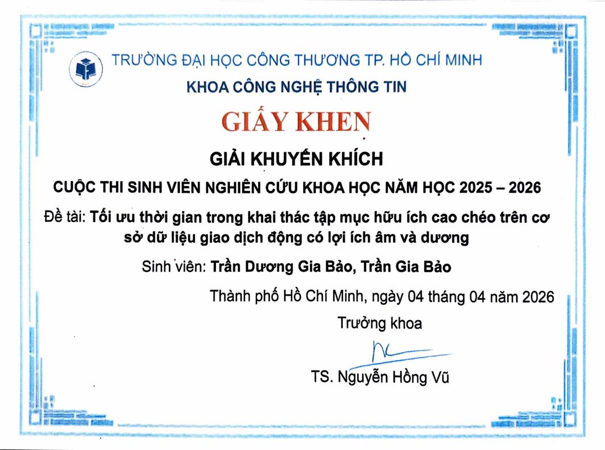
    </td>
    <td align="center" width="50%">
      <strong>科研项目立项与参会证书</strong><br/><br/>
      
    </td>
  </tr>
</table>

- **课题:** *“正负利润交易数据库中高效用项集挖掘的时间性能优化研究”*
- **团队成员:** 陈阳嘉宝 (Trần Dương Gia Bảo), 陈嘉宝 (Trần Gia Bảo)
- **指导教师:** 武文荣硕士 (ThS. Vũ Văn Vinh), 范晋顺硕士 (HV. Phạm Tấn Thuận)
- **答辩时间:** 2026年4月4日
- **项目源码:** [`HUIMiner`](https://github.com/Peo051/HUIMiner) &amp; [`CLHMiner`](https://github.com/Peo051/CLHMiner)

<p align="center">
  <em>在胡志明市工业与贸易大学计算机学院大学生科学研究会议上答辩科研课题，并荣获鼓励奖。</em>
</p>
</details>

---

### 📜 专业认证

<details>
<summary>🎓 <strong>Google AI Professional Certificate (Google AI 专业认证)</strong> &nbsp;(已完成)</summary>
<br/>

- **颁发机构:** Google via Coursera
- **签发日期:** 2026年4月20日
- **凭证核验:** [Verify Professional Certificate](https://coursera.org/verify/professional-cert/9477BZVHLC2N)
- **概览:** 涵盖 AI 基础原理、Prompt 提示词设计体系、文献洞察、内容创作、数据智能分析及 AI 系统架构开发的 7 门进阶课程认证。

<p align="center">
  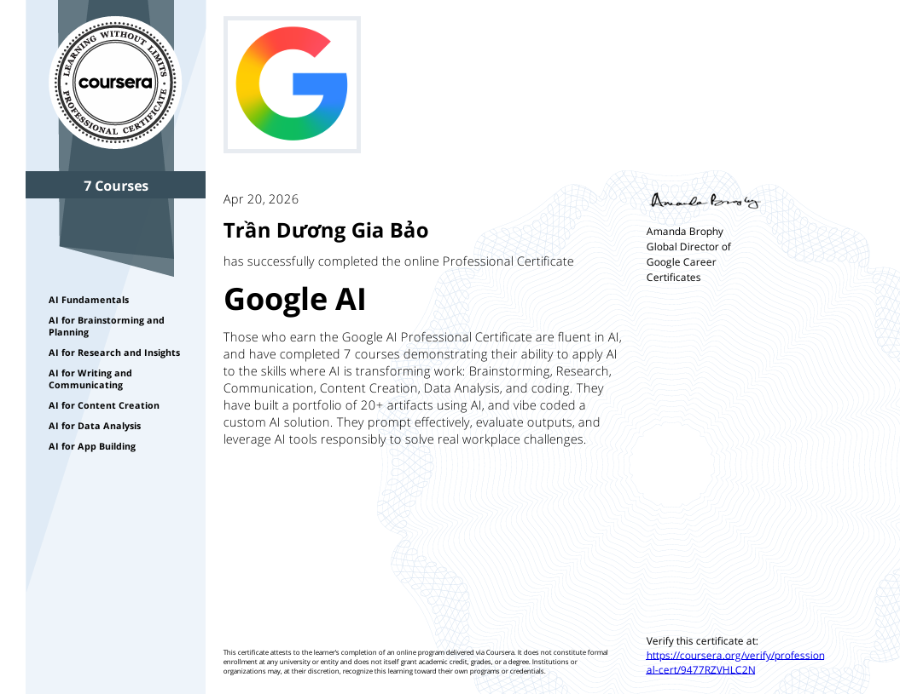
</p>

<details>
<summary>&nbsp;&nbsp;&nbsp;&nbsp;📚 <strong>查看 7 门课程结业证书</strong></summary>
<br/>

<table width="100%">
  <tr>
    <td align="center" width="50%" valign="top">
      <strong>AI Fundamentals</strong><br/>
      <sub><a href="https://coursera.org/verify/LBBNAFKH73YU">核验凭证</a></sub><br/><br/>
      
    </td>
    <td align="center" width="50%" valign="top">
      <strong>AI for Brainstorming and Planning</strong><br/>
      <sub><a href="https://coursera.org/verify/CXD4JWUUX6R1">核验凭证</a></sub><br/><br/>
      
    </td>
  </tr>
  <tr>
    <td align="center" width="50%" valign="top">
      <strong>AI for Research and Insights</strong><br/>
      <sub><a href="https://coursera.org/verify/82WE4I9VAFZ4">核验凭证</a></sub><br/><br/>
      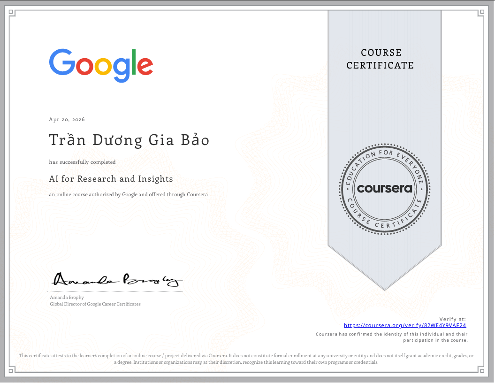
    </td>
    <td align="center" width="50%" valign="top">
      <strong>AI for Writing and Communicating</strong><br/>
      <sub><a href="https://coursera.org/verify/O1LLZPBZJDZO">核验凭证</a></sub><br/><br/>
      
    </td>
  </tr>
  <tr>
    <td align="center" width="50%" valign="top">
      <strong>AI for Content Creation</strong><br/>
      <sub><a href="https://coursera.org/verify/98M51OJHX14HM">核验凭证</a></sub><br/><br/>
      
    </td>
    <td align="center" width="50%" valign="top">
      <strong>AI for Data Analysis</strong><br/>
      <sub><a href="https://coursera.org/verify/0LYMLZ14PN2X">核验凭证</a></sub><br/><br/>
      
    </td>
  </tr>
  <tr>
    <td align="center" width="50%" valign="top">
      <strong>AI for App Building</strong><br/>
      <sub><a href="https://coursera.org/verify/KCQVVQXQVQXQ">核验凭证</a></sub><br/><br/>
      
    </td>
    <td align="center" width="50%" valign="top"></td>
  </tr>
</table>

</details>
</details>

<br/>

<details>
<summary>🎓 <strong>Google AI Essentials Specialization (Google AI 核心技能专项)</strong> &nbsp;(已完成)</summary>
<br/>

- **颁发机构:** Google via Coursera
- **签发日期:** 2026年4月24日
- **凭证核验:** [Verify Specialization](https://coursera.org/verify/specialization/OA4F9JXTDQV2)
- **概览:** 构建生成式 AI 实用技能、工作流效能优化、精准 Prompt 提示词工程与负责任的 AI 开发准则。

<p align="center">
  
</p>

<details>
<summary>&nbsp;&nbsp;&nbsp;&nbsp;📚 <strong>查看 5 门课程结业证书</strong></summary>
<br/>

<table width="100%">
  <tr>
    <td align="center" width="50%" valign="top">
      <strong>Introduction to AI</strong><br/>
      <sub><a href="https://coursera.org/verify/GGGCSVFYV6Z7">核验凭证</a></sub><br/><br/>
      
    </td>
    <td align="center" width="50%" valign="top">
      <strong>Maximize Productivity With AI Tools</strong><br/>
      <sub><a href="https://coursera.org/verify/YLBW8IUHL2AT">核验凭证</a></sub><br/><br/>
      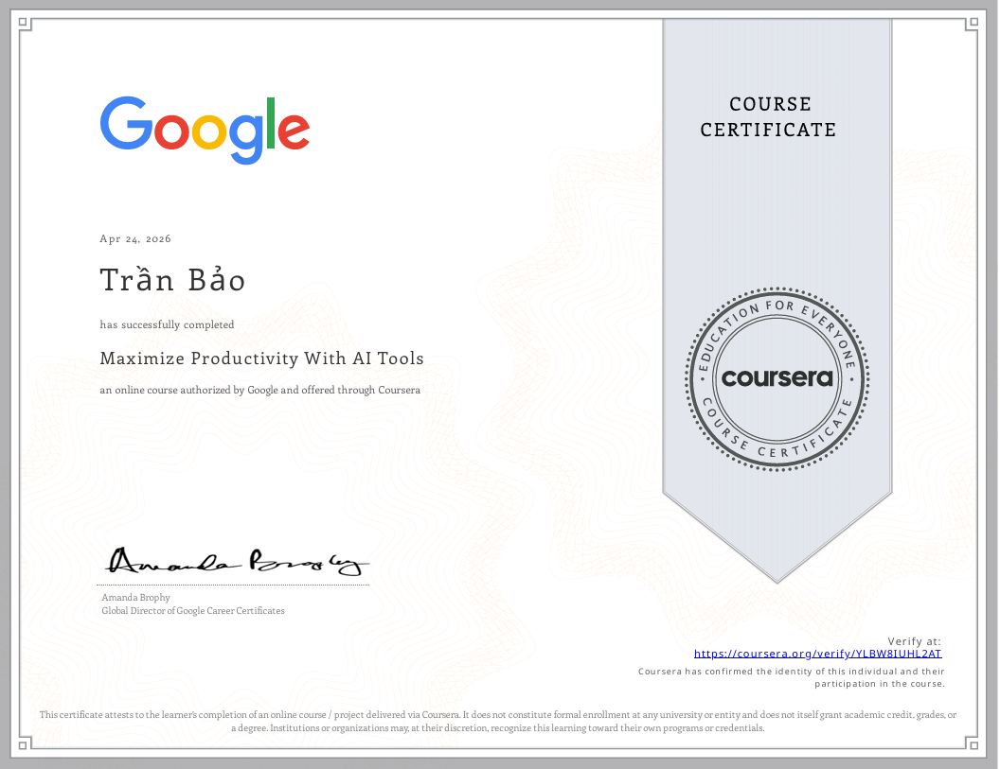
    </td>
  </tr>
  <tr>
    <td align="center" width="50%" valign="top">
      <strong>Discover the Art of Prompting</strong><br/>
      <sub><a href="https://coursera.org/verify/95K4US2N6RI4">核验凭证</a></sub><br/><br/>
      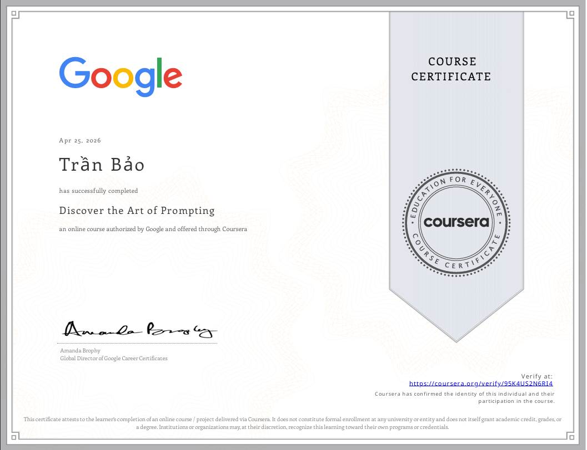
    </td>
    <td align="center" width="50%" valign="top">
      <strong>Use AI Responsibly</strong><br/>
      <sub><a href="https://coursera.org/verify/67U9FYD7X0F3">核验凭证</a></sub><br/><br/>
      
    </td>
  </tr>
  <tr>
    <td align="center" width="50%" valign="top">
      <strong>Stay Ahead of the AI Curve</strong><br/>
      <sub><a href="https://coursera.org/verify/LAOTVMIOVCJW">核验凭证</a></sub><br/><br/>
      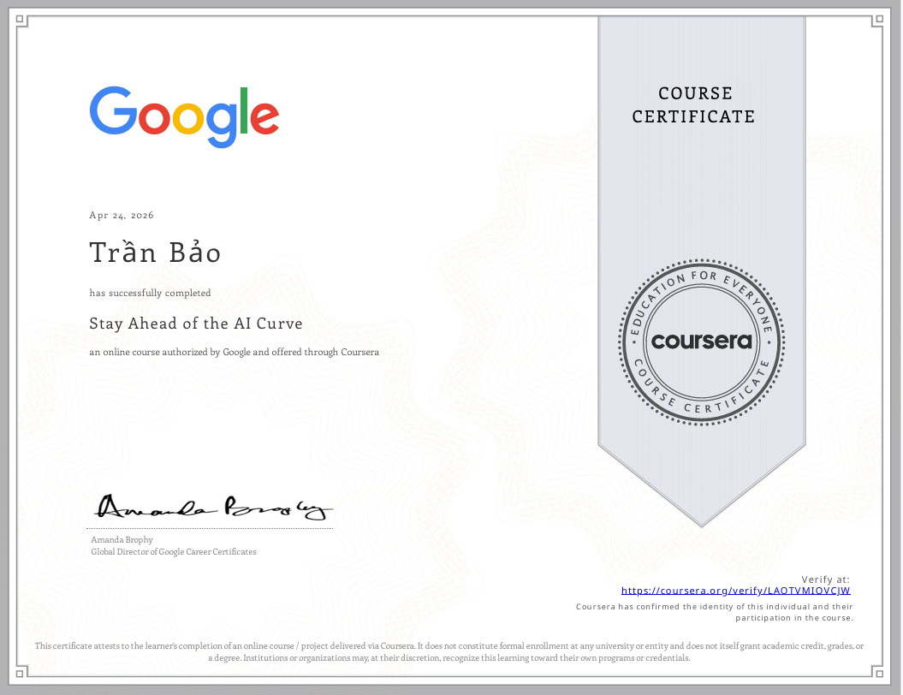
    </td>
    <td align="center" width="50%" valign="top"></td>
  </tr>
</table>

</details>
</details>

<br/>

<details>
<summary>🎓 <strong>Accelerate Your Job Search with AI Specialization (AI 求职加速专项)</strong> &nbsp;(已完成)</summary>
<br/>

- **颁发机构:** Google via Coursera
- **签发日期:** 2026年4月25日
- **凭证核验:** [Verify Specialization](https://coursera.org/verify/specialization/DM1GGN4MS6QE)
- **概览:** 运用 AI 驱动职业规划、梳理可迁移核心技能清单、调研就业市场、定制个性化简历与模拟求职面试流程。

<p align="center">
  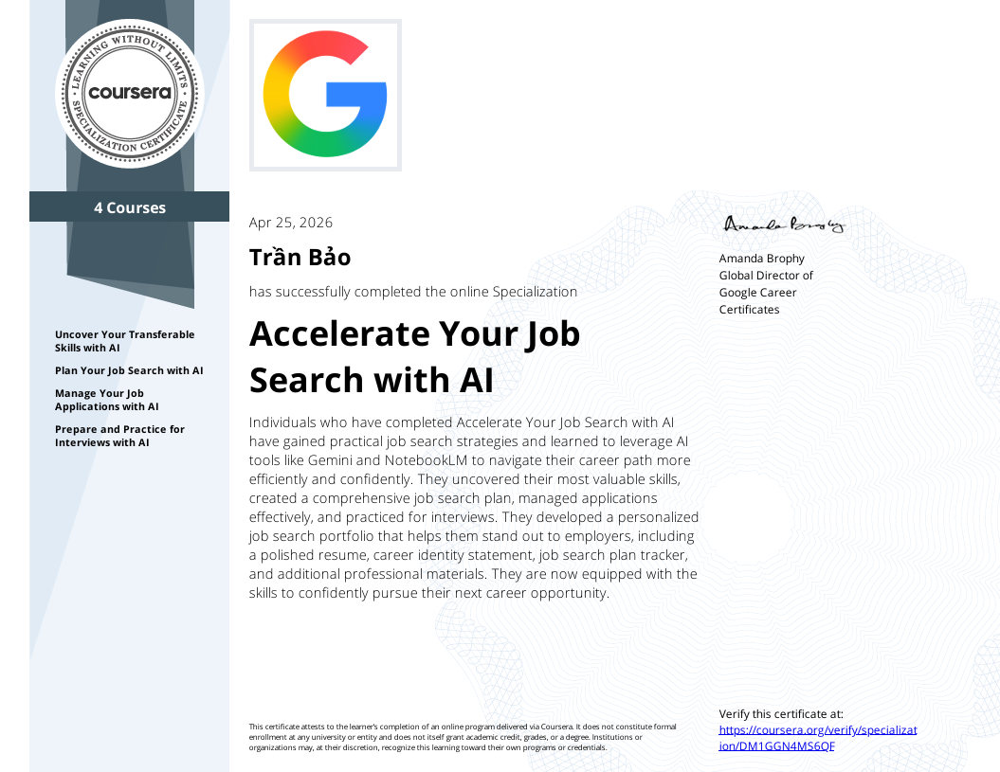
</p>

<details>
<summary>&nbsp;&nbsp;&nbsp;&nbsp;📚 <strong>查看 4 门课程结业证书</strong></summary>
<br/>

<table width="100%">
  <tr>
    <td align="center" width="50%" valign="top">
      <strong>Uncover Your Transferable Skills with AI</strong><br/>
      <sub><a href="https://coursera.org/verify/BOXPIJ1FTNTO">核验凭证</a></sub><br/><br/>
      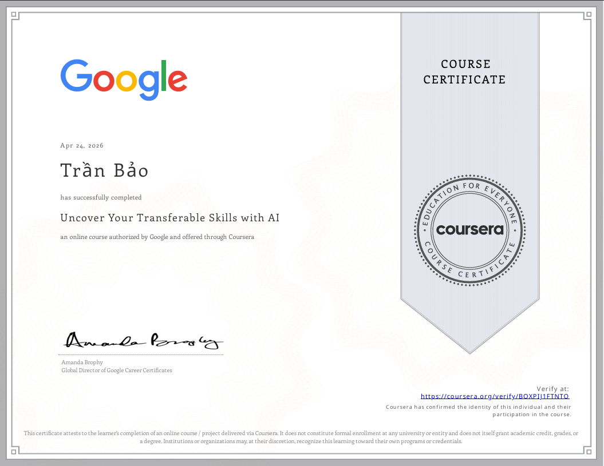
    </td>
    <td align="center" width="50%" valign="top">
      <strong>Plan Your Job Search with AI</strong><br/>
      <sub><a href="https://coursera.org/verify/4KVCJ4AEDZSB">核验凭证</a></sub><br/><br/>
      
    </td>
  </tr>
  <tr>
    <td align="center" width="50%" valign="top">
      <strong>Manage Your Job Applications with AI</strong><br/>
      <sub><a href="https://coursera.org/verify/4EEKR5ME6QIY">核验凭证</a></sub><br/><br/>
      
    </td>
    <td align="center" width="50%" valign="top">
      <strong>Prepare and Practice for Interviews with AI</strong><br/>
      <sub><a href="https://coursera.org/verify/RBQ3URO1UDZ5">核验凭证</a></sub><br/><br/>
      
    </td>
  </tr>
</table>

</details>
</details>

<br/>

<details>
<summary>🎓 <strong>Google Prompting Essentials Specialization (Google 提示词工程专项)</strong> &nbsp;(已完成)</summary>
<br/>

- **颁发机构:** Google via Coursera
- **签发日期:** 2026年4月25日
- **概览:** 面向日常工作与工程任务的进阶 Prompt 设计法则、数据统计加速、自动化报告与作为智能思考伙伴协同创作。

<details>
<summary>&nbsp;&nbsp;&nbsp;&nbsp;📚 <strong>查看 4 门课程结业证书</strong></summary>
<br/>

<table width="100%">
  <tr>
    <td align="center" width="50%" valign="top">
      <strong>Start Writing Prompts like a Pro</strong><br/>
      <sub><a href="https://coursera.org/verify/7D7NHC7BYM89">核验凭证</a></sub><br/><br/>
      
    </td>
    <td align="center" width="50%" valign="top">
      <strong>Design Prompts for Everyday Work Tasks</strong><br/>
      <sub><a href="https://coursera.org/verify/Z8XRRMSZD9A9">核验凭证</a></sub><br/><br/>
      
    </td>
  </tr>
  <tr>
    <td align="center" width="50%" valign="top">
      <strong>Speed Up Data Analysis and Presentation Building</strong><br/>
      <sub><a href="https://coursera.org/verify/KEJ60APLHJLC">核验凭证</a></sub><br/><br/>
      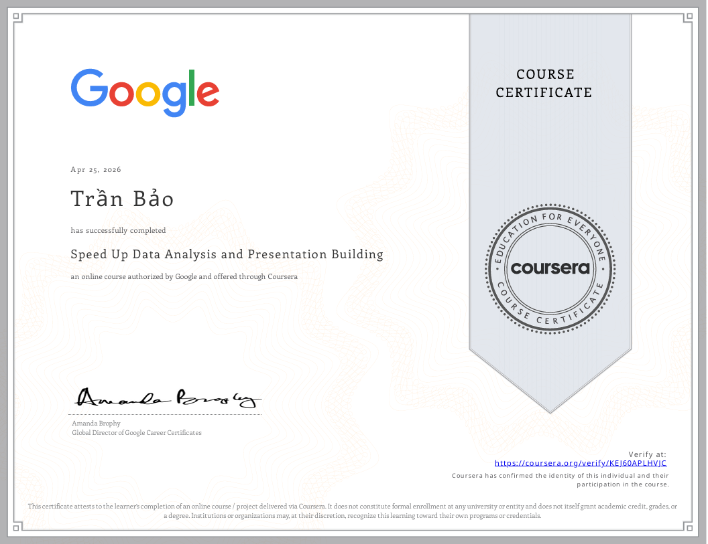
    </td>
    <td align="center" width="50%" valign="top">
      <strong>Use AI as a Creative or Expert Partner</strong><br/>
      <sub><a href="https://coursera.org/verify/UXU8U2ROLZJ09">核验凭证</a></sub><br/><br/>
      
    </td>
  </tr>
</table>

</details>
</details>

<br/>

<details>
<summary>🎓 <strong>Google UX Design Professional Certificate (Google UX 设计专业认证)</strong> &nbsp;(已完成)</summary>
<br/>

- **颁发机构:** Google via Coursera
- **签发日期:** 2026年4月25日
- **凭证核验:** [Verify Professional Certificate](https://coursera.org/verify/professional-cert/CO07OPHIC3ER)
- **概览:** 7 门系统化 UX 设计课程：用户同理心调研、线框图设计、Figma 高保真交互原型制作与动态响应式 Web 界面构筑。

<p align="center">
  
</p>

<details>
<summary>&nbsp;&nbsp;&nbsp;&nbsp;📚 <strong>查看 7 门课程结业证书</strong></summary>
<br/>

<table width="100%">
  <tr>
    <td align="center" width="50%" valign="top">
      <strong>Foundations of User Experience (UX) Design</strong><br/>
      <sub><a href="https://coursera.org/verify/5ACPWD0XBD3W">核验凭证</a></sub><br/><br/>
      
    </td>
    <td align="center" width="50%" valign="top">
      <strong>Start the UX Design Process: Empathize, Define, Ideate</strong><br/>
      <sub><a href="https://coursera.org/verify/926MG2Z7ZQEE">核验凭证</a></sub><br/><br/>
      
    </td>
  </tr>
  <tr>
    <td align="center" width="50%" valign="top">
      <strong>Build Wireframes and Low-Fidelity Prototypes</strong><br/>
      <sub><a href="https://coursera.org/verify/NXQ2IIME4XM4">核验凭证</a></sub><br/><br/>
      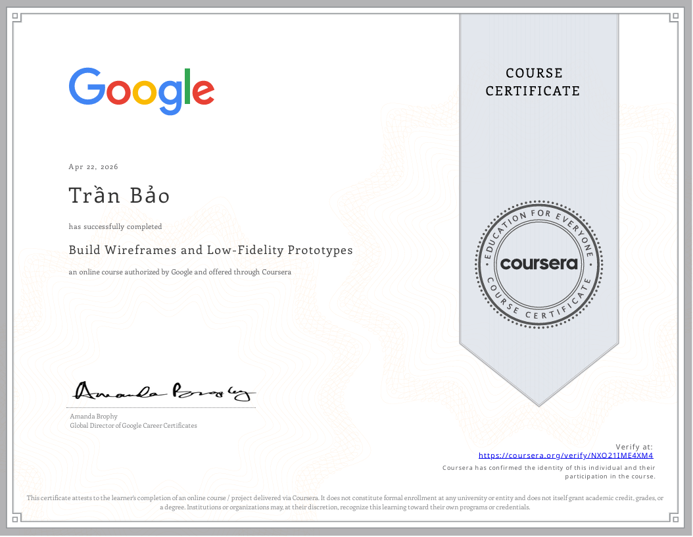
    </td>
    <td align="center" width="50%" valign="top">
      <strong>Conduct UX Research and Test Early Concepts</strong><br/>
      <sub><a href="https://coursera.org/verify/Y4K2LKTMUP5V">核验凭证</a></sub><br/><br/>
      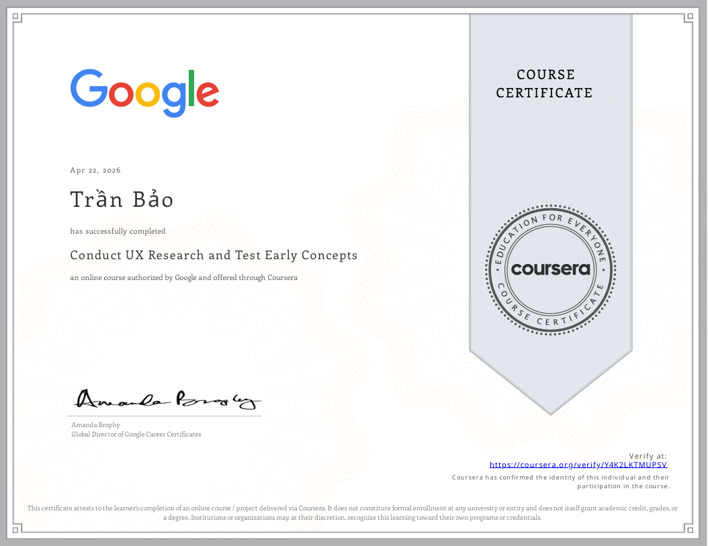
    </td>
  </tr>
  <tr>
    <td align="center" width="50%" valign="top">
      <strong>Create High-Fidelity Designs &amp; Prototypes in Figma</strong><br/>
      <sub><a href="https://coursera.org/verify/33K9GDA8MMPT">核验凭证</a></sub><br/><br/>
      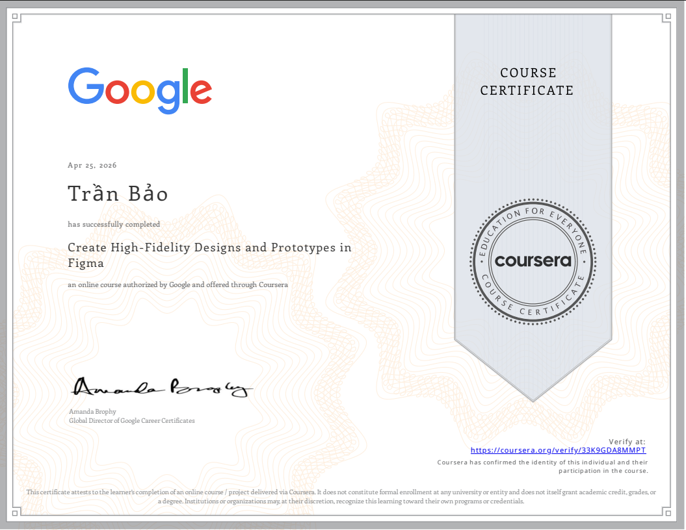
    </td>
    <td align="center" width="50%" valign="top">
      <strong>Build Dynamic User Interfaces (UI) for Websites</strong><br/>
      <sub><a href="https://coursera.org/verify/DRQSN9BG2QL2">核验凭证</a></sub><br/><br/>
      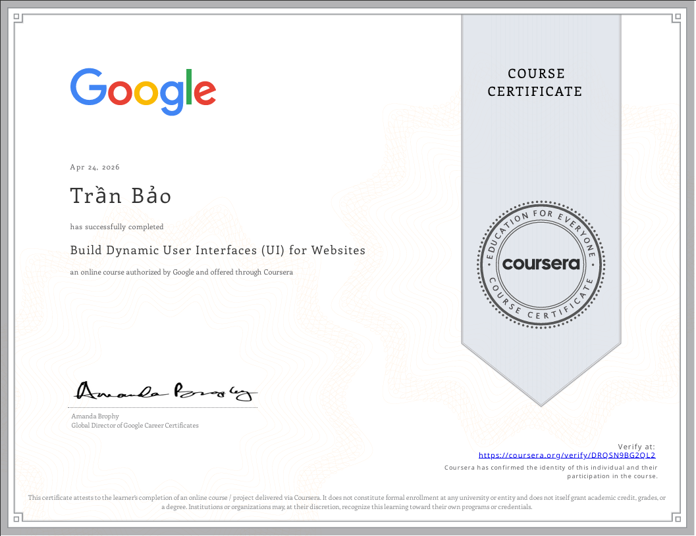
    </td>
  </tr>
  <tr>
    <td align="center" width="50%" valign="top">
      <strong>Design UX for Social Good &amp; Prepare for Jobs</strong><br/>
      <sub><a href="https://coursera.org/verify/B7WZ416MKODO">核验凭证</a></sub><br/><br/>
      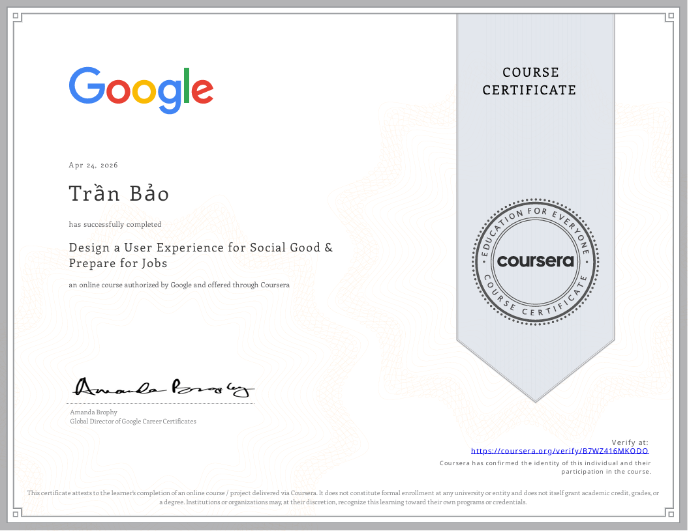
    </td>
    <td align="center" width="50%" valign="top"></td>
  </tr>
</table>

</details>
</details>

<br/>

<details>
<summary>🎓 <strong>AI Application for Game, Web, and Project Management (AI 场景应用实战)</strong></summary>
<br/>

- **主办机构:** 绿量子有限责任公司 (Công ty TNHH Lượng Từ Xanh)
- **实训周期:** 2026年2月4日 – 15日
- **培训地点:** 越南 胡志明市
- **概览:** 实战探究将前沿 AI 技术融入工业级软件架构、游戏系统及敏捷项目管理体系。

<p align="center">
  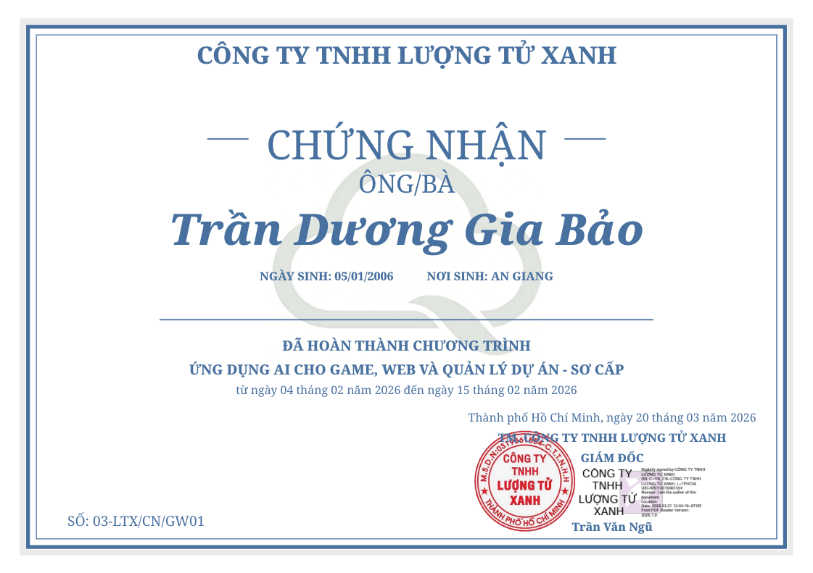
</p>
</details>

<br/>

<details>
<summary>🎓 <strong>Financial Data Analysis and Decision-Making in the Advent of AI (金融数据分析与决策)</strong></summary>
<br/>

- **状态:** 已结业
- **概览:** 基于 AI 工具的计算金融数据分析基石、统计指标推演与智能决策模型化应用。

<p align="center">
  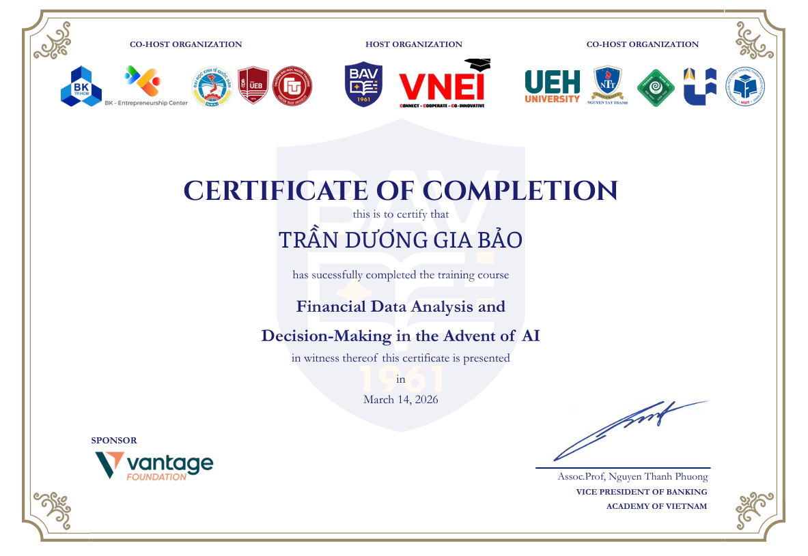
</p>
</details>

<br/>

<details>
<summary>🎓 <strong>Gemini Certified (Google 认证)</strong></summary>
<br/>

- **认证状态:** 已获得权威认证
- **概览:** 彰显在学术科研、知识整合、研究方法论与学习流程中熟练驾驭 Google Gemini 多模态模型的高阶能力。

<table width="100%">
  <tr>
    <td align="center" width="50%" valign="top">
      <strong>Gemini Certified Educator (认证教育导师)</strong><br/><br/>
      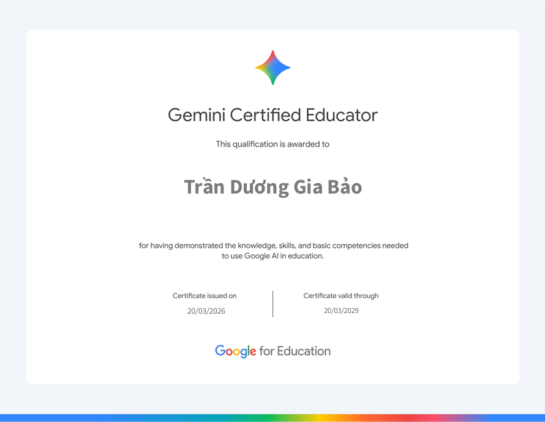
    </td>
    <td align="center" width="50%" valign="top">
      <strong>Gemini Certified University Student (认证大学生)</strong><br/><br/>
      
    </td>
  </tr>
</table>
</details>

---

### 📊 GitHub 数据统计

<div align="center">


&nbsp;


<br/><br/>


</div>

---

### 📬 保持联系

<div align="center">

<a href="mailto:tranduonggiabao0501email@gmail.com">
  
</a>
&nbsp;
<a href="https://peo051.github.io/portfolio/">
  
</a>
&nbsp;
<a href="https://www.linkedin.com/in/peo0501">
  
</a>
&nbsp;
<a href="https://github.com/Peo051">
  
</a>

</div>

<br/>

---

<div align="center">


<sub><i>"First, solve the problem. Then, write the code." — John Johnson</i></sub>

</div>
